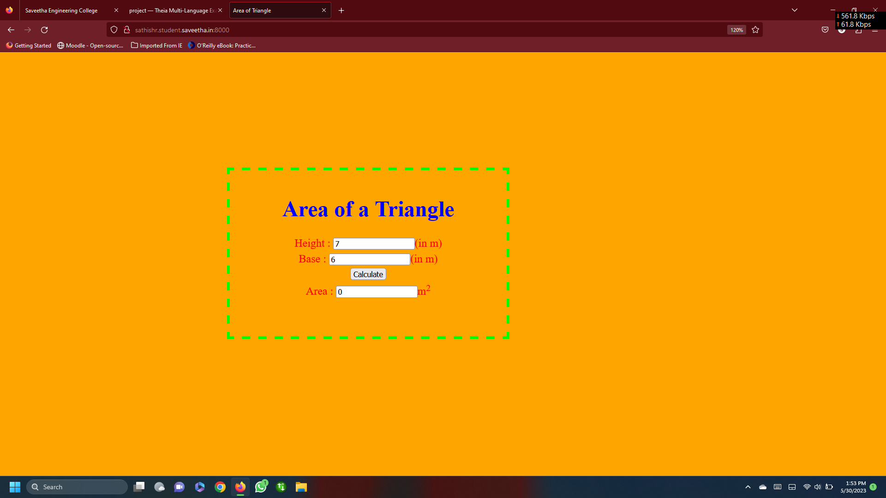

# Design a Website for Server Side Processing

## AIM:
To design a website to perform mathematical calculations in server side.

## DESIGN STEPS:

### Step 1:
Clone into the repository named 'serversideprocessing' and create a project named 'myproj'.
### Step 2:
Startapp 'myfirstapp'.Create a folder named 'templates' under which all html files are stored.
### Step 3:
Make the necessary changes in the settings.py and add codes in urls.py and views.py which enables the operation to take place.
### Step 4:
Under templates and myfirstapp, create a html file named math.html and write the required html code for the website.
### Step 5:
Push to the github.
### Step 6:
Publish the website in the given URL.

## PROGRAM :
#math.html
```html
<html>
<head>
<meta charset='utf-8'>
<meta http-equiv='X-UA-Compatible' content='IE=edge'>
<title>Area of Triangle</title>   
<meta name='viewport' content='width=device-width, initial-scale=1'>
<style>
body {
background-color:orange;    
}
.edge {
width: 1080px;
margin-left: auto;
margin-right: auto;
padding-top: 200px;
padding-left: 300px;    
}
.box {
display:block;
border: Thick dashed lime;
width: 500px;
min-height: 300px;
font-size: 20px;
background-color:dark green;    
}
.formelt {
color:Red;
text-align: center;
margin-top: 5px;
margin-bottom: 5px;    
}
h1{
color: blue;
text-align: center;
padding-top: 20px;    
}
</style> 
</head>    
<body>
<div class="edge">
<div class="box">
<h1>Area of a Triangle</h1> 
<form method="POST">

<div class="formelt">
Height : <input type="text" name="height" value="{{h}}"></input>(in m)<br/>
</div>
<div class="formelt">
Base : <input type="text" name="base" value="{{b}}"></input>(in m)<br/>    
</div>    
<div class="formelt">
<input type="submit" value="Calculate"></input><br/>    
</div>
<div class="formelt">
Area : <input type="text" name="area" value="{{area}}"></input>m<sup>2</sup><br/>    
</div>
</form>   
</div>    
</div>
</body>
</html>
```
#views.py
```python
from django.shortcuts import render
def trianglearea(request):
    context={}
    context['area'] = "0"
    context['h'] = "0"
    context['b'] = "0"
    if request.method == 'POST':
        print("POST method is used")
        h = request.POST.get('height','0')
        b = request.POST.get('base','0')
        print('request=',request)
        print('height=',h)
        print('base=',b)
        area = int(h) * int(b)/2
        context['area'] = area
        context['h'] = h
        context['b'] = b
        print('Area=',area)
    return render(request,'myapp/math.html',context)   
```
#urls.py
```python
from django.contrib import admin
from django.urls import path
from myapp import views
urlpatterns = [
    path('admin/', admin.site.urls),
    path('areaoftriangle/',views.trianglearea,name="areaoftriangle"),
    path('',views.trianglearea,name="areaoftriangleroot")
```
## OUTPUT:

### Home Page:


### Calculations:



## Result:
The program for implementing server side processing is completed successfully.
